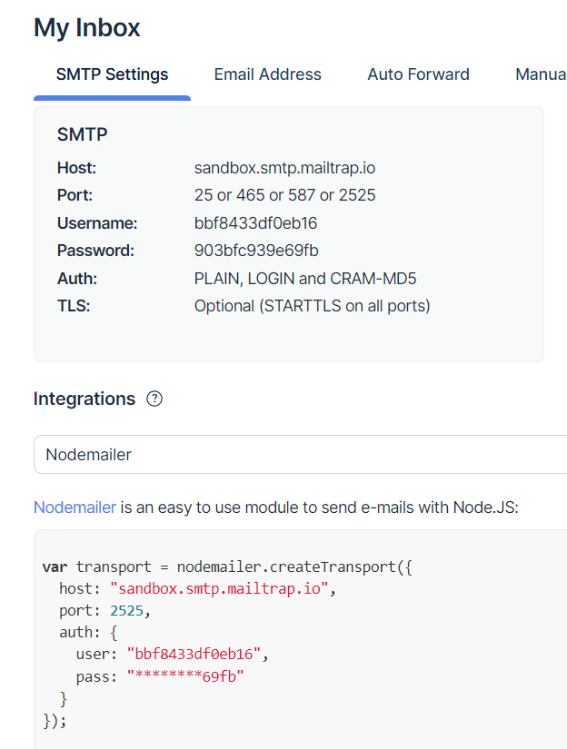

# Development test

1. Ingresar tus credenciales de https://mailtrap.io/ a las variables listadas en el archivo .env y ejecutar docker compose up

MAIL_HOST
MAIL_PORT
MAIL_USER
MAIL_PASS

Demostracion de mail

Demmostracion de base de datos:

